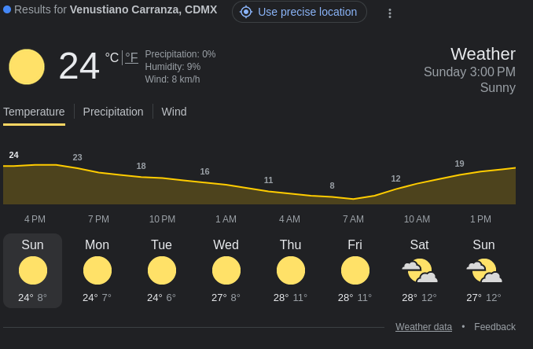
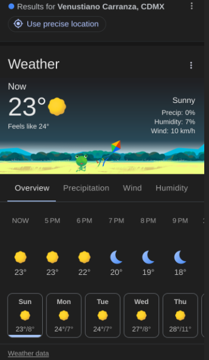

# Weather App

Applicación para mostrar información acerca del pronoxtico del Tiempo

### Desktop



## Mobile



## Requerimientos

- [ ] Acceder a la posición del dispositivo desde el cual se ejecutar al aplicación para obtener los datos siguientes:

  - [ ] Ciudad
  - [ ] País
  - [ ] lugar exacto(botón) y/o cambiar area(desplegar un menú de opciones de lugar de acuerdo a ubicaiones anteriores o a lugares populares cerca de la posicion actual)

**Desktop**


**Mobile**


- [ ] Crear una cabecera para la versión mobil con un menu para cambiar la unidad de medida de la temperatua. En la versión desktop no no muestra esta cabecera

**Mobile**


- [ ] Crear una sección "Temperatura actual" para mostra la siguiente informacion

  **Desktop**  
   lado izquierdo

  - [ ] Temperatura actual
  - [ ] Unidad de medida de la temperatura(desktop). Debe de cambiar la temperatura dinamicamente
  - [ ] Si es de dia o de noche(con unn ícono)
  - [ ] Sensación térmica
  - [ ] Presipitacion(%)
  - [ ] Humedad(%)
  - [ ] Velocidad del viento(km/h)

  Lado derechho

  - [ ] La palabra _Weather_ (solo desktop)
  - [ ] Dia y hora
  - [ ] Visibilidad del cielo

    

  **Mobile**  
  lado izquierdo

  - [ ] Temperatura actual
  - [ ] Unidad de medida de la temperatura(desktop). Debe de cambiar la temperatura dinamicamente
  - [ ] Si es de dia o de noche(con unn ícono)
  - [ ] Sensación térmica

  Lado derechho

  - [ ] La palabra _Weather_ (solo desktop)
  - [ ] Dia y hora
  - [ ] Visibilidad del cielo
  - [ ] Presipitacion(%)
  - [ ] Humedad(%)
  - [ ] Velocidad del viento(km/h)

  ![Current Weather] (/app/assets/mobile/mobile-current-weather.png)

* [ ] Crear la sección "Temperatura los proximos 7 dias" para mostraran los datos de pronóstico del tiemp de los proximos 7 díás. Esta sección tendra un menú con los siguintes elementos:
      **Desktop**

  - [ ] Temperatura
    - [ ] Devajo se mostrar una grafica de la temperatura a traves del tiempo(cada 3 horas)  
           \*La grafica tiendrá un comportamiento como una cintaque se mueve hacia adelante o hacia atras. Tambien podrá ser clickada
  - [ ] Presipitación
  - Debajo se mostrará una grafica con la precipitación
  - [ ] Velocidad del viento

    - [ ] Debajo se mostrará tarjeta que mostre la velocidad y la dirección del viento

    - [ ] Abajo se mostraran tajetas de cada dia, visibilidad y temperatura promedio  
           \*las tarjetas podranse clickadas o presinadas y la grafica reacciona moviendose hacia adelante o hacia atras


**Mobile**

- [ ] _Overview_
  - Devajo se mostrará tarjetas en un carrusel o cinta con scrrol horizontal. Cada tarjeta mostrará la hora, si de dia o de noche y visibilidad, y la temperatura  
    \*El carrusel o cinta podrá se desplazada con los dedos
- [ ] Presipitación
  - Devajo se mostrará tarjetas en un carrusel o cinta con scrrol horizontal. Cada tarjeta mostrará la hora, icono de humedad y precipitacion en %
- [ ] Velocidad promedio del viento
  - Un texto de la velocidad del viento
  - Debajo se mostrará tarjeta que mostre la velocidad y dirección del viento y la hora
- [ ] Humedad
  - [ ] Abajo se mostrara un carrusel o cinta con scroll horizontal. Cada tajeta mostrara el dia, visibilidad y temperatura promedio  
         \*El carrusel o cinta podrá se desplazada con los dedos


- [ ] Agragar mis datos de contacto

## API Open-Meteo

Toda la información metereológica será obtenida del sitio [Open-Meteo](https://open-meteo.com/)

### Endpoint

```
$ curl "https://api.open-meteo.com/v1/forecast?latitude=52.52&longitude=13.41&current=temperature_2m,wind_speed_10m&hourly=temperature_2m,relative_humidity_2m,wind_speed_10m"

```

### Nubosidad

Dependiendo de la fracción de cielo que ocupen las nubes, dividido el cielo en octavos, se definen los siguientes términos:

    Despejado o poco nuboso: [0,1/8] 0% - 12.4%
    Parcialmente nuboso: (1/8,4/8] 12.5% - 49%
    Nuboso: (4/8,5/8] 50% - 62.5%
    Muy nuboso: (5/8,7/8] 62.6% - 87.4%
    Cubierto: (7/8,8/8] 87.5% - 100%
